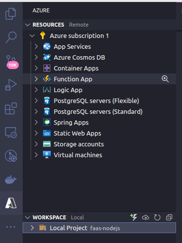
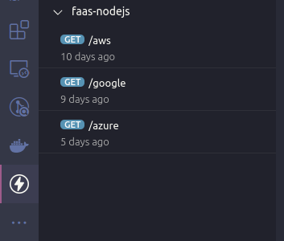

<h1> Function as a Service (FaaS) com Node.js</h1>

<p> Esse projeto tem por finalidade criar e testar localmente funções serverless com o intuito de realizar deploys das mesmas nas clouds AWS Lambda, Google Cloud e Microsoft Azure. Tem por objetivo também a invocação ou requisição das funções serverless em um servidor local node.js.</p>

<h1> Módulo lambda </h1>
<h2>Dependências necessárias do projeto na pasta <strong>/lambda</strong></h2>
<ul>
    <li> Node.js </li>
    <li> Serveless Framework </li>
    <li> Credenciais da conta AWS </li>
</ul>

```
$ cd lambda
$ npm install
$ npm install --save aws-sdk
```

<p> No arquivo serverless.yml são definido as configurações da função lambda.</p>

```
service: aws-nodejs

frameworkVersion: '3'

plugins:
  - serverless-offline

provider:
  name: aws
  runtime: nodejs18.x
  region: us-east-2

functions:
  check_duplicate_papers:
    handler: handler.check_duplicate_papers

```

<h2>Testando a primeira execução</h2>

```
$ serverless invoke local --function check_duplicate_papers
```

<h2> Deploy da função na AWS </h2>
<p> É necessário configurar um usuário na sua conta da AWS e adicionar as seguintes políticas de permissões : </p>
<ul>
    <li>AWSCloudFormationFullAccess	</li>
    <li>AWSLambda_FullAccess</li>
    <li>CloudWatchLogsFullAccess</li>
    <li>IAMFullAccess</li>
</ul>

Também é necessário criar na sua conta AWS **access key ID** e **Secret access key**.

<p> Após essas configurações execute o comando: </p>

```
serverless config credentials --provider **provider** --key **access key ID** --secret **Secret access key**
```

<p> Após isso faça deploy da função.</p>

```
$ serverless deploy
```

<h1> Módulo google_functions </h1>

<h2>Dependências necessárias do projeto na pasta <strong>/google_functions</strong></h2>
<ul>
    <li> Node.js </li>
    <li> Functions Framework </li>
</ul>

```
$ cd lambda
$ npm install
$ npm install --save-dev @google-cloud/functions-framework
```

<h2>Testando a primeira execução</h2>

```
$ npx functions-framework --target=check_duplicate_papers
```
<h2> Deploy da função no Google Cloud </h2>

```
$ gcloud functions deploy "check_duplicate_papers" --trigger-http --runtime="nodejs18"
```

<h1> Módulo HttpTriger1 </h1>
<ul>
    <li> Node.js </li>
    <li> Credenciais da conta Microsoft </li>
</ul>

<p> A criação desse módulo é feita diretamente pelo vscode. Portanto é necessário instalar a extensão <strong>Azure</strong> no vscode, logar com sua conta microsoft, criar um <strong>Function App</strong>, em seguida acesse na aba workspace do vscode clique em <strong>'Create Function...'</strong> escolha as opções 'HttpTrigger', 'Javascript' que aparecerão no menu. Após isso será criado um diretório com o nome da função atribuído e no arquivo 'index.js' é onde deverá ser implementado a função.</p>

<h2> Deploy da função no Azure </h2>
<p> Acesse a extensão do azure no vscode, na aba workspace clique no ícone <strong>Deploy</strong>.</p>



<h1> Módulo backend </h1>

<p> Nesse módulo é criado um servidor node.js básico em que a ideia é fazer requisições ou invocar as funções serverless criadas nos módulos acima. </p>

<h2>Dependências necessárias do projeto na pasta <strong>/backend</strong></h2>
<ul>
    <li> Node.js </li>
</ul>

```
$ cd backend
$ npm install
$ npm start
```

Defina na raiz do projeto um arquivo **.env** substituindo os respectivos valores pelas credenciais obtidas da sua conta na AWS.

```
ACCESSKEYID=access key ID
SECRETACCESSKEY=Secret access key
```

<p> Utilize alguma ferramenta(postman, insomnia, thunder client) que auxilia na criação e testagem de API Rest para facilitar a visualização. </p>



Ou acesse via browser [http://localhost:3333/aws](http://localhost:3333/aws), [http://localhost:3333/google](http://localhost:3333/google), [http://localhost:3333/azure](http://localhost:3333/azure).


